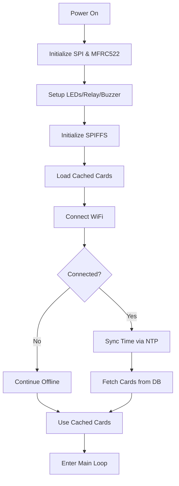
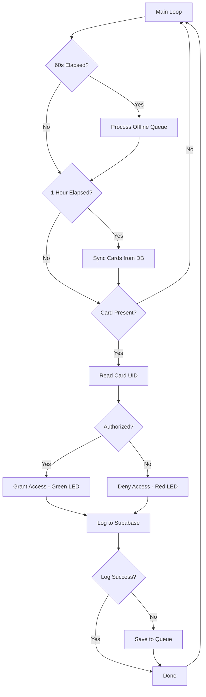

# rfidCard_scanner - Active Arduino Firmware

**Status:** ✅ Active - This is the current production firmware for the EduQure access control system

## 📋 Overview

This directory contains the **Arduino C++ firmware** for the ESP32-based RFID access control system. It replaces the legacy MicroPython implementation with a more robust, modular solution.

### Key Improvements Over Legacy
- ✅ **Dynamic card management** - No hardcoded UIDs, synced from database
- ✅ **Modular architecture** - Separated into logical header files
- ✅ **Better hardware support** - Uses mature MFRC522 library
- ✅ **Enhanced feedback** - LED indicators and buzzer tones
- ✅ **More reliable** - Better error handling and offline resilience

---

## 📂 File Structure

```
rfidCard_scanner/
├── rfidCard_scanner.ino    # Main Arduino sketch (setup + loop)
├── access_control.h        # Physical access control (relay, LEDs, buzzer)
├── network_manager.h       # WiFi connection & Supabase HTTP sync
├── offline_queue.h         # SPIFFS-based offline log queue
├── card_manager.h          # Dynamic card whitelist management
├── secrets.h               # WiFi & API credentials (DO NOT COMMIT)
├── secrets.example.h       # Template for secrets file
└── README.md              # This file
```

---

## 🎯 File Descriptions

### rfidCard_scanner.ino
**Main Arduino Sketch** - Entry point for the firmware

**Key Functions:**
- `setup()` - Initialize hardware, WiFi, SPIFFS, load cards, initial sync
- `loop()` - Main event loop handling card scans, queue processing, and card sync
- `syncCards()` - Fetch latest authorized cards from database

**Loop Tasks:**
1. Process offline queue every 60 seconds
2. Sync card database every 1 hour
3. Scan for RFID cards continuously
4. Validate, respond, and log each card scan

---

### access_control.h
**Physical Access Control Module**

**GPIO Pins:**
```cpp
#define red_led 25      // Red LED (access denied)
#define green_led 26    // Green LED (access granted)
// #define RELAY_PIN 26  // Relay for lock (commented out)
// #define BUZZER_PIN 25 // Buzzer (commented out)
```

**Functions:**
- `setupAccessControl()` - Initialize GPIO pins
- `grantAccess()` - Turn on green LED (1 second), unlock door
- `denyAccess()` - Turn on red LED (1 second), deny entry

**Current State:** Relay and buzzer are commented out. Only LED feedback is active.

---

### network_manager.h
**WiFi & Cloud Communication Module**

**Key Functions:**

#### `setupWiFi()`
- Connects to WiFi using credentials from `secrets.h`
- 15-second timeout with fallback to offline mode
- Syncs NTP time for South Africa (UTC+2)

#### `getISOTime()`
- Returns current time in ISO 8601 format with timezone
- Example: `"2026-01-31T15:14:49+02:00"`
- Used for timestamping access logs

#### `sendLogToSupabase(uid, accessGranted, timestamp)`
- Sends access event to Supabase
- Routes to `access_logs` table if granted
- Routes to `unidentified_cards` table if denied
- Returns `true` on success (HTTP 200-299)

**Payload Examples:**

**Access Granted:**
```json
{
  "card_uid": "0x1a2b3c4d",
  "lock": "main_gate",
  "status": true,
  "created_at": "2026-01-31T15:14:49+02:00"
}
```

**Access Denied (Unidentified):**
```json
{
  "card_uid": "0x9f8e7d6c",
  "lock": "main_gate",
  "created_at": "2026-01-31T15:14:49+02:00"
}
```

#### `fetchCardsJSON()`
- Fetches authorized card UIDs from `persons` table
- Returns JSON array: `[{"card_uid": "0x..."}, ...]`
- Called every hour to keep whitelist updated

---

### offline_queue.h
**Offline Log Queue Management**

**Key Functions:**

#### `setupQueue()`
- Initializes SPIFFS file system
- Must be called in `setup()` before other SPIFFS operations

#### `saveToQueue(uid, accessGranted, timestamp)`
- Saves failed log to `/queue.txt` in SPIFFS
- Each line is a JSON object
- Appends to file (doesn't overwrite)

**Queue Format:**
```json
{"card_uid":"0x1a2b3c4d","status":true,"created_at":"2026-01-31T15:14:49+02:00"}
{"card_uid":"0x5e6f7a8b","status":false,"created_at":"2026-01-31T15:15:12+02:00"}
```

#### `processQueue()`
- Reads all queued logs from file
- Attempts to sync each to Supabase
- Removes successfully synced logs
- Rewrites file with remaining failed logs
- Deletes file if all logs synced

**Call Frequency:** Every 60 seconds in main loop

---

### card_manager.h
**Dynamic Card Whitelist Manager**

**Global Variable:**
```cpp
std::vector<String> authorizedCards;  // In-memory card whitelist
```

**Key Functions:**

#### `loadCardsFromFile()`
- Reads `/cards.json` from SPIFFS
- Populates `authorizedCards` vector
- Called on boot to restore last known whitelist

#### `saveCardsToFile()`
- Writes `authorizedCards` to `/cards.json`
- Persists whitelist for offline operation
- Called after successful database sync

#### `isCardAuthorized(uid)`
- Checks if UID exists in `authorizedCards`
- Case-insensitive comparison
- Returns `true` if authorized, `false` otherwise

#### `refreshCards(jsonPayload)`
- Parses JSON array from `fetchCardsJSON()`
- Replaces `authorizedCards` with new list
- Saves to SPIFFS for persistence
- Handles empty/invalid JSON gracefully

**Storage Format (`/cards.json`):**
```json
["0x1a2b3c4d", "0x5e6f7a8b", "0x9c0d1e2f"]
```

---

### secrets.h
**Configuration & Credentials** ⚠️ **DO NOT COMMIT**

**Required Constants:**
```cpp
#define WIFI_SSID "YourNetworkName"
#define WIFI_PASS "YourPassword"
#define SUPABASE_URL "https://yourproject.supabase.co"
#define SUPABASE_KEY "your.anon.key.here"
#define LOCK_ID "main_gate"  // Identifier for this lock
```

**Setup:**
1. Copy `secrets.example.h` to `secrets.h`
2. Fill in your actual credentials
3. Never commit `secrets.h` to Git (add to `.gitignore`)

---

### secrets.example.h
**Template for secrets.h**

Safe to commit. Shows structure without revealing credentials.

---

## 🔧 Hardware Setup

### Complete Wiring Diagram

```
ESP32 Pin    →    Component
─────────────────────────────
3.3V         →    MFRC522 VCC
GND          →    MFRC522 GND
GPIO 5       →    MFRC522 SDA (SS)
GPIO 22      →    MFRC522 RST
GPIO 18      →    MFRC522 SCK
GPIO 23      →    MFRC522 MOSI
GPIO 19      →    MFRC522 MISO

GPIO 25      →    Red LED (+) → [220Ω] → GND
GPIO 26      →    Green LED (+) → [220Ω] → GND

// Optional (currently commented out):
GPIO 4       →    Relay Signal
GPIO 13      →    Buzzer (+)
```

### MFRC522 Connections

**SPI Bus:**
| MFRC522 Pin | ESP32 GPIO | Description |
|-------------|------------|-------------|
| VCC | 3.3V | Power (DO NOT use 5V) |
| GND | GND | Ground |
| RST | 22 | Reset |
| SDA (SS) | 5 | Slave Select |
| SCK | 18 | SPI Clock |
| MOSI | 23 | Master Out Slave In |
| MISO | 19 | Master In Slave Out |

⚠️ **Important:** MFRC522 is 3.3V only! Do NOT connect VCC to 5V or you'll damage it.

### LED Connections

```
ESP32 GPIO 25 ──┬─[220Ω Resistor]─┬─ Red LED Anode (+)
                                   └─ LED Cathode (-) ── GND

ESP32 GPIO 26 ──┬─[220Ω Resistor]─┬─ Green LED Anode (+)
                                   └─ LED Cathode (-) ── GND
```

### Optional Components (Commented Out)

To enable relay and buzzer, uncomment the code in `access_control.h`:

**Relay:**
```cpp
// Uncomment in access_control.h:
#define RELAY_PIN 4
pinMode(RELAY_PIN, OUTPUT);
digitalWrite(RELAY_PIN, HIGH);  // Active LOW relay
```

**Buzzer:**
```cpp
// Uncomment in access_control.h:
#define BUZZER_PIN 13
pinMode(BUZZER_PIN, OUTPUT);
```

---

## 🚀 Installation

### 1. Prerequisites

**Software:**
- [Arduino IDE](https://www.arduino.cc/en/software) 1.8.x or 2.x
- ESP32 board support installed
- USB driver for your ESP32 board

**Libraries:**
Install via **Sketch → Include Library → Manage Libraries**:
- **MFRC522** by GithubCommunity (latest version)
- **ArduinoJson** by Benoit Blanchon (v6.x)

### 2. Board Setup

1. Open Arduino IDE
2. Go to **Tools → Board → ESP32 Arduino → ESP32 Dev Module**
3. Set these options:
   - Upload Speed: 115200
   - Flash Frequency: 80MHz
   - Flash Mode: QIO
   - Flash Size: 4MB
   - Partition Scheme: Default 4MB with SPIFFS
   - Core Debug Level: None

### 3. Configure Credentials

```bash
# Navigate to firmware directory
cd firmware/rfidCard_scanner/

# Copy template
cp secrets.example.h secrets.h

# Edit secrets.h with your credentials
# (Use notepad, VS Code, or any text editor)
```

**secrets.h content:**
```cpp
#ifndef SECRETS_H
#define SECRETS_H

// WiFi Credentials
#define WIFI_SSID "SchoolWiFi_2.4GHz"
#define WIFI_PASS "YourSecurePassword123"

// Supabase Configuration
#define SUPABASE_URL "https://xyzabc123.supabase.co"
#define SUPABASE_KEY "eyJhbGciOiJIUzI1NiIsInR5cCI6IkpXVCJ9..."

// Lock Identifier
#define LOCK_ID "main_gate"  // Change per installation

#endif
```

### 4. Upload Firmware

1. Connect ESP32 via USB
2. Select correct **Port** (Tools → Port → COMx or /dev/ttyUSBx)
3. Open `rfidCard_scanner.ino`
4. Click **Upload** (→) button
5. Wait for "Hard resetting via RTS pin..." message

### 5. Verify Operation

Open **Serial Monitor** (Tools → Serial Monitor) at **115200 baud**:

**Expected Output:**
```
--- School Access System v2.1 (Dynamic Sync) ---
Connecting to WiFi...
WiFi Connected! IP: 192.168.1.150
Waiting for time sync...
Time synced.
Loaded 0 cards from local storage.
Syncing cards from DB...
Fetched cards from DB
Loaded 45 authorized cards
Updated authorized cards list. Count: 45
Cards saved to local storage.
System Online
Scan your RFID card...
```

---

## 🔄 Operation Flow

### Startup Sequence



### Main Loop



### Card Scan Event

1. **Detect** - MFRC522 detects card in field
2. **Read** - Extract UID bytes
3. **Format** - Convert to hex string (e.g., `0x04a1b2c3`)
4. **Validate** - Check against `authorizedCards` vector
5. **Respond** - LED on, relay activate (if enabled)
6. **Log** - Send to Supabase immediately
7. **Queue** - If log fails, save to SPIFFS
8. **Reset** - Halt card, reinitialize reader

---

## 📊 Data Flow

### Access Granted Flow

```
Card Scanned (UID: 0x1a2b3c4d)
    ↓
isCardAuthorized(uid) → TRUE
    ↓
grantAccess()
    ├─ Green LED ON (1 sec)
    └─ Relay ON (3 sec) [if enabled]
    ↓
getISOTime() → "2026-01-31T15:14:49+02:00"
    ↓
sendLogToSupabase(uid, true, timestamp)
    ↓
POST https://yourproject.supabase.co/rest/v1/access_logs
    ↓
┌────────────┬─────────────┐
│  Success   │   Failure   │
│  (200 OK)  │ (No WiFi)   │
└─────┬──────┴──────┬──────┘
      ↓             ↓
    Done    saveToQueue(uid, true, timestamp)
                    ↓
            Retry in 60 seconds
```

### Access Denied Flow

```
Card Scanned (UID: 0x9f8e7d6c)
    ↓
isCardAuthorized(uid) → FALSE
    ↓
denyAccess()
    └─ Red LED ON (1 sec)
    ↓
getISOTime() → "2026-01-31T15:14:49+02:00"
    ↓
sendLogToSupabase(uid, false, timestamp)
    ↓
POST https://yourproject.supabase.co/rest/v1/unidentified_cards
    ↓
┌────────────┬─────────────┐
│  Success   │   Failure   │
└─────┬──────┴──────┬──────┘
      ↓             ↓
    Done    saveToQueue(uid, false, timestamp)
```

---

## 🐛 Troubleshooting

### ESP32 Won't Upload

**Symptoms:**
- "Failed to connect" error
- "Timed out waiting for packet header"

**Solutions:**
1. Hold **BOOT** button while clicking Upload
2. Try different USB cable (data-capable, not charge-only)
3. Install CH340/CP2102 USB driver
4. Lower upload speed (Tools → Upload Speed → 115200)

---

### WiFi Connection Fails

**Serial Output:**
```
Connecting to WiFi.........
WiFi Connection Failed (Continuing in Offline Mode)
```

**Checklist:**
- ✅ Verify SSID in `secrets.h` (case-sensitive)
- ✅ Verify password is correct
- ✅ Ensure 2.4GHz network (ESP32 doesn't support 5GHz)
- ✅ Check if network has MAC filtering (whitelist ESP32 MAC)
- ✅ Try moving ESP32 closer to router

**Test WiFi:**
```cpp
// Add to setup():
WiFi.scanNetworks();
// Check if your SSID appears in list
```

---

### MFRC522 Not Detecting Cards

**Serial Output:**
```
WARNING: Communication failure, is the MFRC522 properly connected?
```

**Wiring Checklist:**
| MFRC522 | ESP32 | Status |
|---------|-------|--------|
| VCC | 3.3V (NOT 5V!) | ⚠️ Critical |
| GND | GND | ✅ |
| RST | GPIO 22 | ✅ |
| SDA | GPIO 5 | ✅ |
| SCK | GPIO 18 | ✅ |
| MOSI | GPIO 23 | ✅ |
| MISO | GPIO 19 | ✅ |

**Common Issues:**
- ❌ **VCC to 5V** - Will damage MFRC522! Use 3.3V only
- ❌ **Loose connections** - Use soldered connections, not breadboard
- ❌ **Wrong pins** - Verify pin mapping in code matches wiring
- ❌ **Insufficient power** - Use external 3.3V regulator if needed

**Test MFRC522:**
```cpp
// In setup(), after rfid.PCD_Init():
rfid.PCD_DumpVersionToSerial();
// Should show "Firmware Version: 0x92 = v2.0"
```

---

### Cards Detected But Always Denied

**Serial Output:**
```
scanned UID: 0x04a1b2c3
ACCESS DENIED
```

**Cause:** Card not in authorized list

**Solutions:**

1. **Check Database**
   - Go to Supabase → Table Editor → `persons`
   - Verify `card_uid` column has this UID
   - Format must match: `0x04a1b2c3` (lowercase hex)

2. **Force Card Sync**
   - Wait up to 1 hour for automatic sync
   - OR restart ESP32 to sync immediately
   - Monitor Serial: "Loaded X authorized cards"

3. **Manual Test**
   ```cpp
   // Add to loop() for debugging:
   Serial.print("Authorized cards: ");
   Serial.println(authorizedCards.size());
   for (const String& card : authorizedCards) {
       Serial.println(card);
   }
   ```

---

### Logs Not Uploading to Supabase

**Serial Output:**
```
Supabase Sync Error: 401
Response: {"message":"Invalid API key"}
```

**HTTP Error Codes:**

| Code | Meaning | Solution |
|------|---------|----------|
| 401 | Unauthorized | Check SUPABASE_KEY in `secrets.h` |
| 403 | Forbidden | Check RLS policies in Supabase |
| 404 | Not Found | Verify table names (`access_logs`, `unidentified_cards`) |
| 500 | Server Error | Check Supabase status page |

**Checklist:**
1. ✅ Verify SUPABASE_URL (should end with `.supabase.co`)
2. ✅ Verify SUPABASE_KEY (anon key, not service_role)
3. ✅ Check RLS policies allow INSERT for anon key
4. ✅ Test URL in browser (should show Supabase page)

**Test Supabase Connection:**
```cpp
// Simplified test in setup():
HTTPClient http;
http.begin("https://yourproject.supabase.co/rest/v1/persons");
http.addHeader("apikey", SUPABASE_KEY);
int code = http.GET();
Serial.println(code);  // Should be 200
```

---

### Offline Queue Growing

**Symptoms:**
- Queue file keeps growing
- Logs never sync despite WiFi connection

**Cause:** Network issues or Supabase errors

**Debug Steps:**

1. **Check Queue Contents**
   ```cpp
   // View queue file in Serial Monitor:
   File file = SPIFFS.open("/queue.txt", FILE_READ);
   while (file.available()) {
       Serial.println(file.readStringUntil('\n'));
   }
   file.close();
   ```

2. **Monitor Queue Processing**
   ```cpp
   // processQueue() will show:
   "Synced offline log for 0x04a1b2c3"  // Success
   "Supabase Sync Error: XXX"           // Failure
   ```

3. **Clear Queue Manually** (if corrupted)
   ```cpp
   // In setup(), one time only:
   SPIFFS.remove("/queue.txt");
   ```

---

### Time Sync Issues

**Serial Output:**
```
Failed to obtain time
```

**Impact:**
- Timestamps will be empty
- Logs may fail if database requires timestamp

**Solutions:**
1. Ensure WiFi is connected before NTP sync
2. Check NTP server accessibility
3. Increase wait time in `setupWiFi()`:
   ```cpp
   while (!getLocalTime(&timeinfo) && millis() - start < 10000) {
       // Increased to 10 seconds
   ```

---

### SPIFFS Errors

**Serial Output:**
```
An Error has occurred while mounting SPIFFS
Failed to open file for appending
```

**Causes:**
- SPIFFS not formatted
- Partition scheme incorrect
- Flash corruption

**Solutions:**

1. **Reformat SPIFFS**
   ```cpp
   // In setup(), one time only:
   SPIFFS.format();
   ```

2. **Check Partition Scheme**
   - Tools → Partition Scheme → "Default 4MB with SPIFFS"

3. **Full Erase**
   - Tools → Erase Flash → "All Flash Contents"
   - Re-upload firmware

---

## 📈 Performance & Limits

### Card Scan Rate
- **Polling interval:** ~50ms
- **Max scans/second:** ~20 (limited by RFID physics)
- **Practical rate:** 1-2 cards/second (prevents double-reads)

### Memory Usage
- **Flash:** ~500KB firmware + libraries
- **SPIFFS:** Up to 1.5MB (depends on partition)
- **RAM:** ~40KB (authorizedCards + buffers)

### Card Whitelist Size
- **Typical:** 50-500 cards
- **Maximum:** ~5,000 cards (limited by RAM)
- **Storage:** ~20 bytes per card UID

### Queue Capacity
- **File size limit:** ~1MB (SPIFFS)
- **Entries:** ~5,000-10,000 queued logs
- **Auto-cleanup:** Successfully synced logs removed

---

## 🔐 Security Considerations

### ⚠️ Important Warnings

1. **Never Commit `secrets.h`**
   ```bash
   # Add to .gitignore:
   firmware/rfidCard_scanner/secrets.h
   ```

2. **Use Anon Key**
   - Only use anon/public key from Supabase
   - Enable RLS on ALL tables
   - Never use service_role key in firmware

3. **HTTPS Only**
   - All Supabase requests use HTTPS
   - Credentials encrypted in transit
   - No plain HTTP support

4. **Physical Security**
   - Secure ESP32 in tamper-proof enclosure
   - Cover USB port to prevent firmware theft
   - Use epoxy to secure wiring

### Best Practices

✅ **DO:**
- Rotate API keys periodically
- Monitor unidentified logs for suspicious activity
- Use unique LOCK_ID per gate
- Update firmware regularly

❌ **DON'T:**
- Share secrets.h or commit to Git
- Use weak WiFi passwords
- Expose Serial output in production
- Use service_role key

---

## 🔧 Advanced Configuration

### Change Card Sync Interval

```cpp
// In rfidCard_scanner.ino, change:
const unsigned long SYNC_INTERVAL = 3600000;  // 1 hour
// To:
const unsigned long SYNC_INTERVAL = 1800000;  // 30 minutes
```

### Change Queue Processing Interval

```cpp
// In rfidCard_scanner.ino, change:
const unsigned long QUEUE_INTERVAL = 60000;  // 60 seconds
// To:
const unsigned long QUEUE_INTERVAL = 30000;  // 30 seconds
```

### Enable Relay Control

```cpp
// In access_control.h, uncomment:
#define RELAY_PIN 4
// And in setupAccessControl():
pinMode(RELAY_PIN, OUTPUT);
digitalWrite(RELAY_PIN, HIGH);  // Active LOW
// And in grantAccess():
digitalWrite(RELAY_PIN, LOW);   // Unlock
delay(3000);
digitalWrite(RELAY_PIN, HIGH);  // Lock
```

### Enable Buzzer Sounds

```cpp
// In access_control.h, uncomment:
#define BUZZER_PIN 13
// And add buzzer tones in grantAccess() and denyAccess()
tone(BUZZER_PIN, frequency, duration);
```

### Multi-Gate Setup

Each gate needs unique configuration:

**Gate 1 (secrets.h):**
```cpp
#define LOCK_ID "main_entrance"
```

**Gate 2 (secrets.h):**
```cpp
#define LOCK_ID "back_gate"
```

This allows tracking which gate was used in access logs.

---

## 📚 Related Documentation

- **[Parent Firmware README](../README.md)** - Overview of all firmware
- **[Main Project README](../../README.md)** - Complete project documentation
- **[Client README](../../client/README.md)** - Dashboard setup

---

## 🤝 Contributing

When modifying this firmware:

1. **Test thoroughly** before deploying to production
2. **Update this README** with any changes
3. **Use consistent coding style** (2-space indentation)
4. **Add comments** for complex logic
5. **Update version number** in startup message

---

## 📄 License

Part of the EduQure project. See main README for license information.

---

## 📞 Support

**For issues:**
1. Check this README's troubleshooting section
2. Review Serial Monitor output at 115200 baud
3. Check parent firmware documentation
4. Review Supabase logs for API errors

**Version:** 2.1  
**Last Updated:** January 2026  
**Status:** ✅ Production Ready
